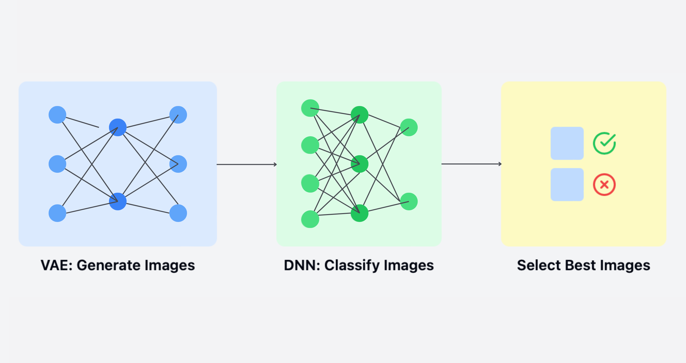
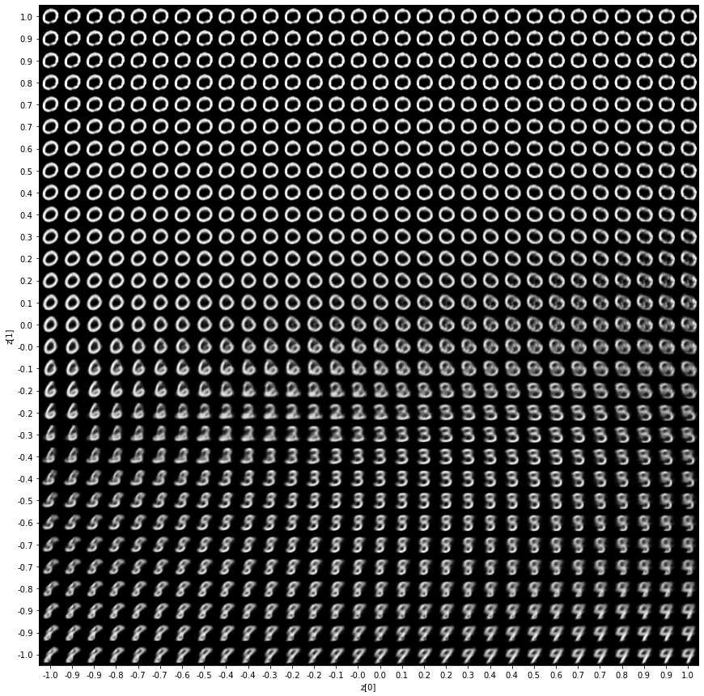
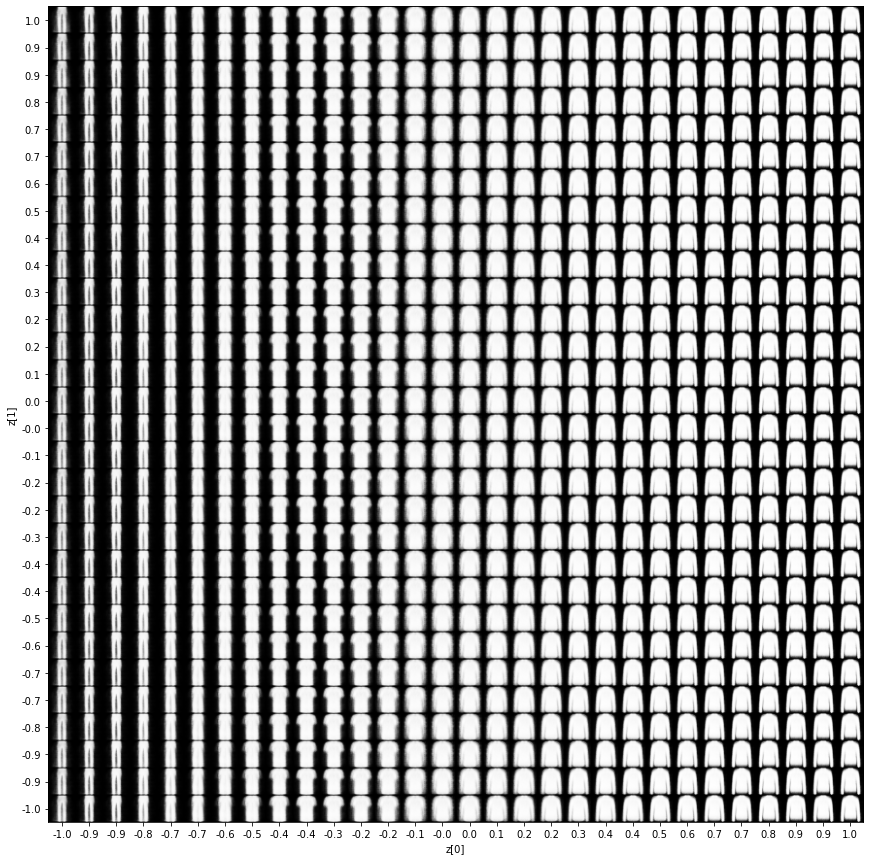
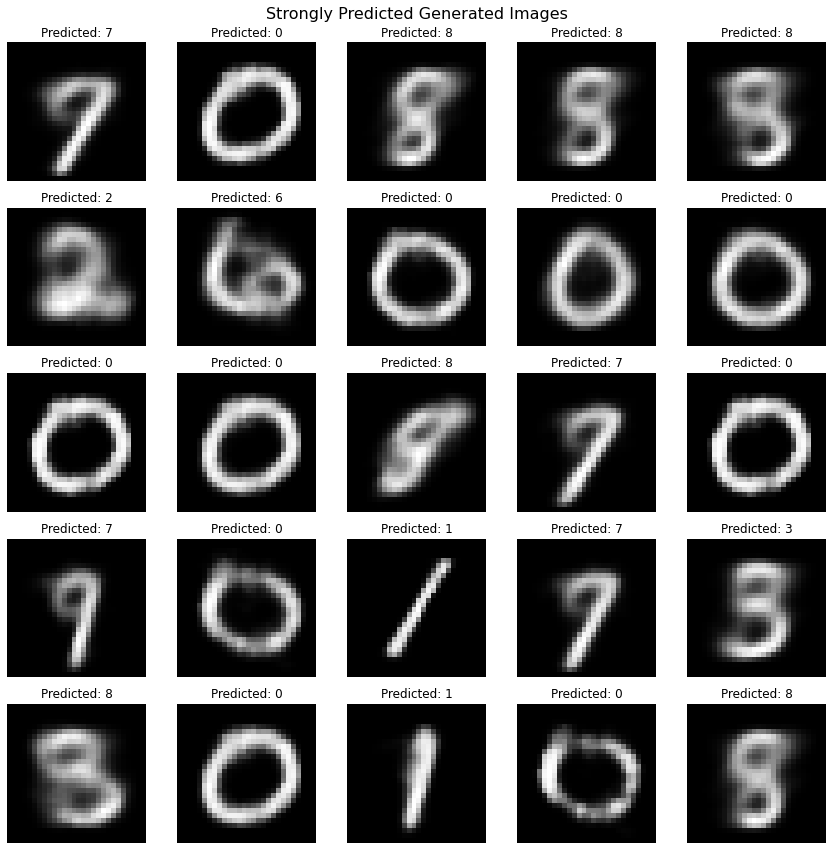
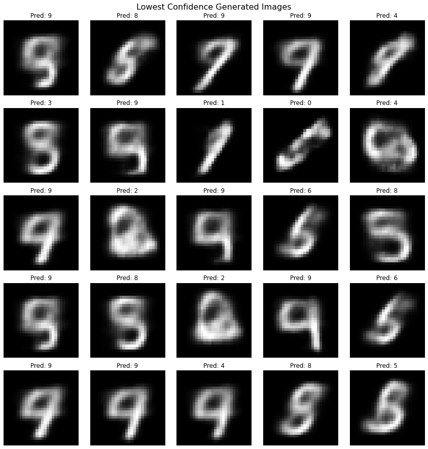
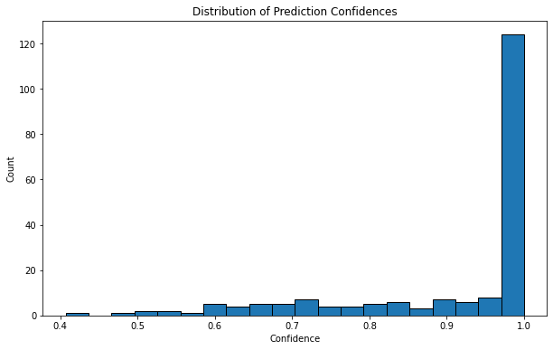

# VAE implementation and Using a DNN classifier to benchmark the generated VAE images for MNIST

<p align="center">
  
</p>

This toy project is an exercise of implementing a Variational Autoencoder using TensorFlow and Keras.

## Requirements

- Python 3.7+
- TensorFlow 2.x
- NumPy
- Matplotlib

Install the required packages using:

```
pip install -r requirements.txt
```

## Sanity Check

VAE is trained on MNIST and Fashion MNIST first, in the file `vae_demo.py`. The results are as expected.

<p align="center">
  
</p>

And similarly for Fashion MNIST.

<p align="center">
  
</p>

## Using a DNN classifier to benchmark the generated VAE images for MNIST

In the file `demo_dnn-vae.py` (a code that may run 5-10 minutes on a laptop), we first train a DNN classifier on MNIST. And then a VAE on MNIST.

We then generate data with VAE and use the DNN to predict the generated images labels. If the prediction is strong, (more than 95%) we accept the new data image. This method needs revision, to make sure that the data is balanced (!), and the calibration and over/under-confidence analysis can make the case stronger, compared to directly taking the prediction of the DNN as real probability.

We can see the strong prediction generated VAE data, it also makes sense to human eyes.

<p align="center">
  
</p>

And some weakly predicted generated images are below.

<p align="center">
  
</p>

### Notes

- A question to look into: are the best selected images, correlated way too much with the training data? Since generator and classifier models used the same dataset, it may cause bias. It would be better to measure correlation between training data and the selected generated data, and do another implementation using separate datasets. But in the end, this was a toy model, still can be interesting.

- DNN has a prediction confidence distribution, since this is a toy example model, it is just a concept.

<p align="center">
  
</p>

## License

MIT
